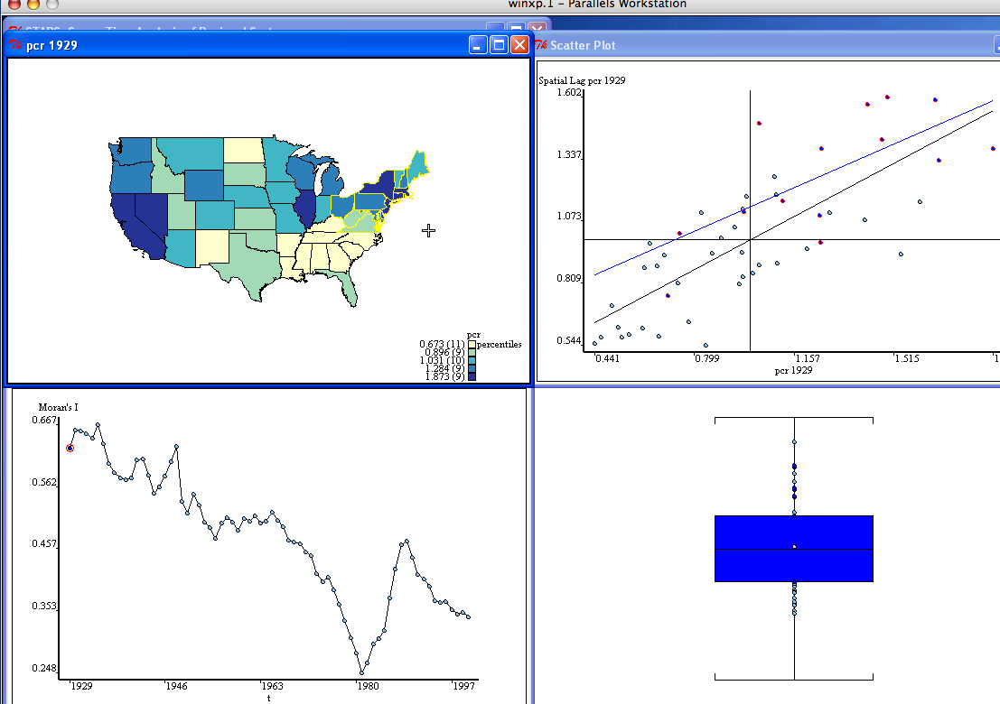

#####
STARS
#####

Space-Time Analysis of Regional Systems: a package for exploratory space-time
data analysis.

The current version of STARS is based on a refactoring to move from Numeric
to Numpy. This version should work on the following platforms

- Linux
- Windows
- Mac 

Installation
============

Using Conda (All Platforms)
---------------------------

1. Install `Anaconda Python Distribution
   <https://www.continuum.io/downloads>`_
2. ``conda create -n stars python=2``
3. ``conda activate stars``
4. ``pip install numpy==1.8 matplotlib scipy``
5. ``cd stars; python -i starsgui.py``

Vagrant under Ubuntu
--------------------

Build and run the box:

1. ``sudo apt-get install virtualbox``
2. ``sudo apt-get install vagrant``
3. ``vagrant up``
4. ``vagrant ssh``
5. ``cd stars``
6. ``python -i starsgui.py -i``

The initial build will take some time, however future boots of the VM
will be fast:

1. ``vagrant up``
2. ``vagrant ssh``
3. ``cd stars``
4. ``python -i starsgui.py -i``

If the following error is encountered::

        URL: ["https://vagrantcloud.com/ubuntu/trusty32"]
        Error: error setting certificate verify locations:
          CAfile: /etc/ssl/certs/ca-bundle.crt
          CApath: none

The solution on 15.04 is::

        cd /etc/ssl/certs
        sudo cp ca-certificates.crt ca-bundle.crt

Source
------

Currently only source installs are available:

1. Download source archive from master_
2. ``cd stars-master/stars``
3. ``python -i starsgui.py``

Mac OS X Notes
--------------

There is a bug with Tk under Mavericks resulting in slow updates of the views.
Installing `Active Python <http://www.activestate.com/activepython>`_ is a work-around.

The Tk bug has been fixed in Yosemite. 

Windows Notes
-------------

STARS has been tested on the following versions:

- Windows XP
- Windows 7
- Windows 8
- Windows 8.1

Road Map
========

For more details on the plans for development, see
`STARS History and Road Map <https://github.com/sjsrey/stars/blob/master/docs/history.rst>`_.

Links
=====

* STARS previous home_ 
* STARS downloads_
* PySAL_ 

.. _master: https://github.com/sjsrey/stars/archive/master.zip
.. _home: http://regionalanalysislab.org
.. _downloads: http://regionalanalysislab.org/?n=Download
.. _PySAL: http://pysal.org
